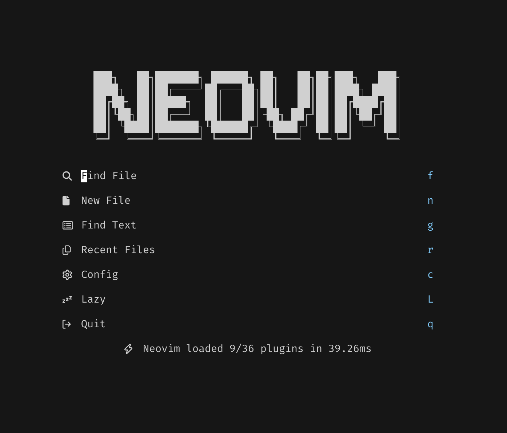

# nvim

This repository hosts my personal [Neovim](https://neovim.io) configuration that works on Linux/macOS.



## Features

- Plugin manager: [lazy](https://github.com/folke/lazy.nvim)
- Theme: [Rose Pine](https://github.com/rose-pine/neovim)
- Fuzzy finder: [fzf-lua](https://github.com/ibhagwan/fzf-lua)
- File tree: [neo-tree](https://github.com/nvim-neo-tree/neo-tree.nvim)
- Collection of QoL plugins: [snacks](https://github.com/folke/snacks.nvim)
- tmux window navigator: [vim-tmux-navigator](https://github.com/christoomey/vim-tmux-navigator)
- Statusline: [lualine](https://github.com/nvim-lualine/lualine.nvim)
- Git integration for buffers: [gitsigns](https://github.com/lewis6991/gitsigns.nvim)
- Keyboard shortcut hints: [which-key](https://github.com/folke/which-key.nvim)
- Add/change/delete surrounding delimiter pairs: [mini.surround](https://github.com/echasnovski/mini.surround)
- Commenting: [Comment](https://github.com/numToStr/Comment.nvim)
- Autopairs: [mini.pairs](https://github.com/echasnovski/mini.pairs)
- Syntax highlighter and parser: [nvim-treesitter](https://github.com/nvim-treesitter/nvim-treesitter)
- LSP: [Native LSP](https://neovim.io/doc/user/lsp.html)
- Autocomplete engine and snippets: [blink](https://github.com/Saghen/blink.cmp)
- Debugger support: [nvim-dap](https://github.com/mfussenegger/nvim-dap) and [nvim-dap-ui](https://github.com/rcarriga/nvim-dap-ui)
- Code formatting: [conform](https://github.com/stevearc/conform.nvim)
- Package manager for LSP servers, DAP servers, linters and formatters: [mason.nvim](https://github.com/williamboman/mason.nvim)

## Install

### Prerequisites

- [Neovim](https://neovim.io) 👻
- A modern terminal emulator that supports true colors. You may install [Alacritty](https://alacritty.org), [Ghostty](https://ghostty.org), [kitty](https://sw.kovidgoyal.net/kitty), or [WezTerm](https://wezfurlong.org/wezterm). For a full list of terminals that supports true colors, head to this [repo](For a full list of terminals that supports true colors, see [here](https://github.com/termstandard/colors?tab=readme-ov-file#terminal-emulators))
- A font that supports glyphs (icons). We can install a patched font from [Nerd Fonts](https://www.nerdfonts.com/)
- [fd](https://github.com/sharkdp/fd) and [ripgrep](https://github.com/BurntSushi/ripgrep), both required by the [fzf-lua](https://github.com/ibhagwan/fzf-lua?tab=readme-ov-file) plugin

### Setup

After installing the above, clone this repository under the `~/.config` directory:

```sh
git clone https://github.com/djamseed/nvim.git ~/.config
```

Open your terminal and run `nvim`. Once opened, all plugins will be automatically installed by Lazy.nvim.
