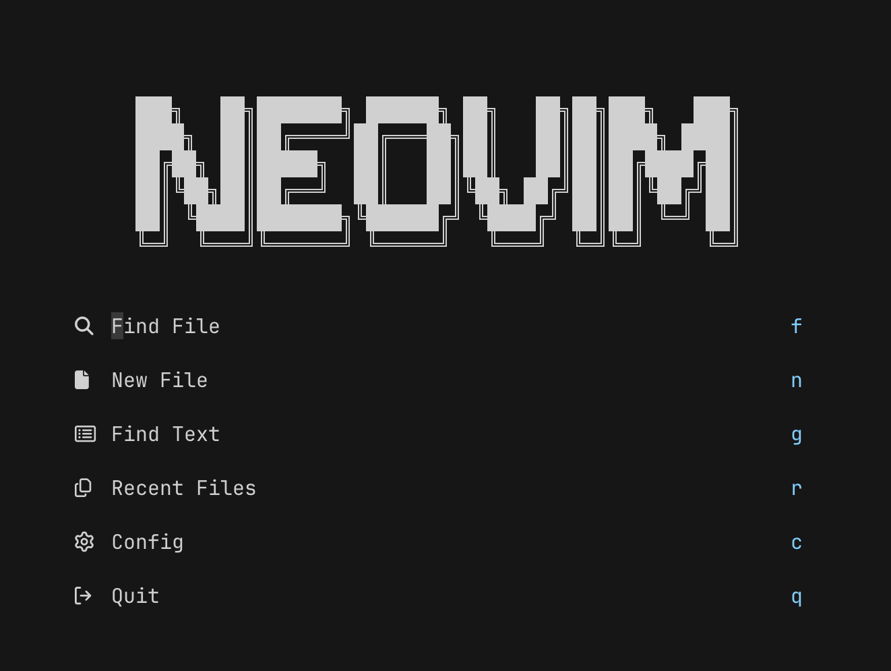

# nvim

My personal [Neovim](https://neovim.io) configuration for Linux and macOS. No plugin-manager
dependency — plugins are managed by Neovim's built-in [`vim.pack`](https://neovim.io/doc/user/pack.html).



## Requirements

- **Neovim 0.12+** (uses `vim.pack`, `vim.lsp.enable`, and the `lsp/` config directory)
- A true-color terminal — [Ghostty](https://ghostty.org), [kitty](https://sw.kovidgoyal.net/kitty),
  [WezTerm](https://wezfurlong.org/wezterm), or [Alacritty](https://alacritty.org)
  ([full list](https://github.com/termstandard/colors#terminal-emulators))
- A [Nerd Font](https://www.nerdfonts.com) for glyphs
- [`fd`](https://github.com/sharkdp/fd) and [`rg`](https://github.com/BurntSushi/ripgrep) for the picker
- `git`, plus `cc`/`gcc` for compiling treesitter parsers
- Optional: `cargo` (builds blink.cmp's Rust fuzzy matcher), `go`, `dotnet`, `node`

## Install

```sh
git clone https://github.com/djamseed/nvim.git ~/.config/nvim
nvim
```

On first launch `vim.pack` clones every plugin, mason installs the language servers and
formatters, and treesitter compiles its parsers. Restart once when it settles.

## Layout

```
init.lua              entry point
lua/core/             options, keymaps, autocmds, LSP + diagnostics
lua/plugins/          one file per plugin; loaded alphabetically by lua/plugins/init.lua
lsp/                  per-server configs, picked up by vim.lsp.enable()
after/ftplugin/       per-filetype overrides
```

Adding a plugin is a new file in `lua/plugins/` that calls `vim.pack.add(...)`; adding a
language server is a new file in `lsp/` plus its name in the `vim.lsp.enable` list in
`lua/core/lsp.lua`. Files load in alphabetical order, so a module that depends on another
(lualine on the colorscheme, for instance) must sort after it.

## What's in it

| Area | Plugin |
| --- | --- |
| Plugin manager | built-in [`vim.pack`](https://neovim.io/doc/user/pack.html) |
| Theme | [oxocarbon](https://github.com/nyoom-engineering/oxocarbon.nvim) |
| Picker, explorer, dashboard, notifier | [snacks](https://github.com/folke/snacks.nvim) |
| Statusline | [lualine](https://github.com/nvim-lualine/lualine.nvim) |
| Completion & snippets | [blink.cmp](https://github.com/Saghen/blink.cmp) + [friendly-snippets](https://github.com/rafamadriz/friendly-snippets) |
| Syntax & folds | [nvim-treesitter](https://github.com/nvim-treesitter/nvim-treesitter) (+ [context](https://github.com/nvim-treesitter/nvim-treesitter-context), [textobjects](https://github.com/nvim-treesitter/nvim-treesitter-textobjects)) |
| Textobjects, pairs, surround, icons | [mini.ai / mini.pairs / mini.surround / mini.icons](https://github.com/nvim-mini) |
| LSP | native `vim.lsp` + [mason](https://github.com/mason-org/mason.nvim) + [roslyn.nvim](https://github.com/seblyng/roslyn.nvim) |
| Formatting | [conform](https://github.com/stevearc/conform.nvim) |
| Debugging | [nvim-dap](https://github.com/mfussenegger/nvim-dap) + [dap-ui](https://github.com/rcarriga/nvim-dap-ui), [dap-go](https://github.com/leoluz/nvim-dap-go), [dap-cs](https://github.com/NicholasMata/nvim-dap-cs) |
| Git | [gitsigns](https://github.com/lewis6991/gitsigns.nvim) |
| Quickfix | [nvim-bqf](https://github.com/kevinhwang91/nvim-bqf) |
| Keybind hints | [which-key](https://github.com/folke/which-key.nvim) |
| tmux navigation | [vim-tmux-navigator](https://github.com/christoomey/vim-tmux-navigator) |
| Indent detection | [guess-indent](https://github.com/NMAC427/guess-indent.nvim) |
| TODO highlighting | [todo-comments](https://github.com/folke/todo-comments.nvim) |

Undotree, netrw replacement (snacks explorer), and the message/cmdline UI all come from
Neovim itself — no plugin needed.

### Language servers

`bashls`, `buf_ls`, `gopls`, `jsonls`, `lua_ls`, `roslyn` (C#), `ruff` (Python), `yamlls`, `zls`.
Binaries are installed automatically by `mason-tool-installer` on startup.

## Keymaps

Leader is `<Space>`. `which-key` shows the rest — this is just the map of the territory.

### Find (`<leader>f`)

| Key | Action |
| --- | --- |
| `<leader>ff` / `<leader>fg` | Find files / git files |
| `<leader>fs` / `<leader>fw` | Grep project / grep word under cursor |
| `<leader>fb` / `<leader>fr` | Open buffers / recent files |
| `<leader>f/` | Fuzzy-search the current buffer |
| `<leader>fd` / `<leader>ft` | Diagnostics / TODO comments |
| `<leader>fh` / `<leader>fk` / `<leader>fq` | Help / keymaps / quickfix |
| `\` | Toggle file explorer |

### LSP & diagnostics

| Key | Action |
| --- | --- |
| `K` / `gs` | Hover docs / signature help |
| `gd` / `gD` / `gri` / `grt` | Definition / declaration / implementation / type definition |
| `grr` / `grn` / `gra` | References / rename / code action |
| `gO` | Document symbols |
| `<leader>d` / `<leader>D` | Buffer / workspace diagnostics → quickfix |
| `<leader>cf` | Format buffer (also runs on save) |

### Git (`<leader>g`)

`gs`/`gS` stage hunk/buffer, `gr`/`gR` reset hunk/buffer, `gu` undo stage,
`gp`/`gP` preview hunk (float/inline), `gb` blame line, `gd` diff against index.

### Debug

| Key | Action |
| --- | --- |
| `<F5>` | Start / continue |
| `<F7>` / `<F8>` / `<S-F8>` | Step into / over / out |
| `<F9>` | Toggle DAP UI |
| `<leader>bb` / `<leader>bc` / `<leader>B` | Toggle / clear / conditional breakpoint |

The whole DAP stack is lazy — nothing is configured until you press one of these.

### Toggles & misc

| Key | Action |
| --- | --- |
| `<leader>ti` / `<leader>tw` / `<leader>th` | Indent guides / wrap / inlay hints |
| `<leader>u` | Undotree |
| `<leader>q` / `<leader>r` | Close window / restart Neovim |
| `<C-h/j/k/l>` | Move between splits and tmux panes |
| `<C-s>` | Write |
| `sa` / `sd` / `sr` | Add / delete / replace surrounding |

## Notes

- `d` and `x` write to the black-hole register, so they never clobber your yank.
  Use `"ad` or a cut-then-`p` workflow if you need the text back.
- `mini.surround` owns the `s` prefix in normal and visual mode. Ex commands are
  unaffected (`:%s/old/new/g` still works); only normal-mode `s` (≡ `cl`) is shadowed.
- Formatting on save is synchronous with a 500 ms budget, falling back to the LSP
  when no formatter is configured for the filetype.

## Maintenance

| Command | Purpose |
| --- | --- |
| `:lua vim.pack.update()` | Update plugins |
| `:Mason` | Manage LSP servers, formatters, debug adapters |
| `:TSUpdate` | Update treesitter parsers |
| `:checkhealth` | Diagnose problems |
| `:LspInfo` | Inspect attached LSP clients |
