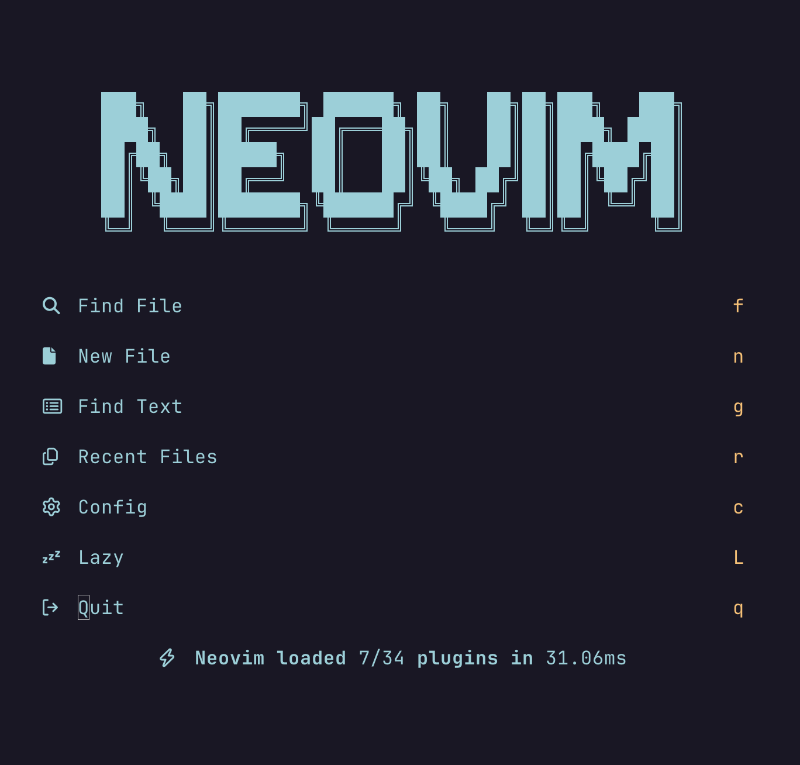

# nvim

This repository host my configuration for Neovim.



## Install

### Prerequisites

- A terminal emulator that supports true colors. For macOS, we can install [iTerm2](https://iterm2.com/), [kitty](https://sw.kovidgoyal.net/kitty/), or [Alacritty](https://alacritty.org/). For a full list of terminals that supports true colors, see [here](https://github.com/termstandard/colors?tab=readme-ov-file#terminal-emulators)
- A font that supports glyphs (icons). We can install a patched font from [Nerd Fonts](https://www.nerdfonts.com/)
- [ripgrep](https://github.com/BurntSushi/ripgrep) (rg) is a fast grepping tool that is used by several plugins such as [Telescope](https://github.com/nvim-telescope/telescope.nvim).

### Install Neovim

On macOS, it is recommended to install Neovim via [Homebrew](https://brew.sh). Simply run the following command:

```sh
brew install neovim
```

### Setting up Neovim

After installing `nvim` and all of the dependencies, clone this repo under the `~/.config` directory (macOS/Linux):

```sh
git clone https://github.com/djamseed/nvim.git ~/.config
```

When we first open Neovim, all the plugins will be automatically installed.

## Features

- Plugin manager - [lazy.nvim](https://github.com/folke/lazy.nvim)
- Color scheme - [Catppuccin](https://github.com/catppuccin/nvim)
- File explorer - [nvim-tree](https://github.com/nvim-tree/nvim-tree.lua)
- Fuzzy finder - [telescope.nvim](https://github.com/nvim-telescope/telescope.nvim)
- Marked file navigation - [harpoon](https://github.com/ThePrimeagen/harpoon)
- Statusline - [lualine.nvim](https://github.com/nvim-lualine/lualine.nvim)
- Greeter - [alpha-nvim](https://github.com/goolord/alpha-nvim)
- Keyboard shortcut hints - [which-key.nvim](https://github.com/folke/which-key.nvim)
- tmux window navigator - [vim-tmux-navigator](https://github.com/christoomey/vim-tmux-navigator)
- Auto pair - [nvim-autopairs](https://github.com/windwp/nvim-autopairs)
- Add/remove/change pairs - [nvim-surround](https://github.com/kylechui/nvim-surround)
- Session manager - [auto-session](https://github.com/rmagatti/auto-session)
- Automatic tabstop/shiftwidth detection - [vim-sleuth](https://github.com/tpope/vim-sleuth)
- Syntax highlighter and parser - [nvim-treesitter](https://github.com/nvim-treesitter/nvim-treesitter)
- Commenting - [Comment.nvim](https://github.com/catppuccin/nvim)
- Git integration - [vim-fugitive](https://github.com/tpope/vim-fugitive) 
- Git decorations - [gitsigns.nvim](https://github.com/lewis6991/gitsigns.nvim)
- Indentation guides - [indent-blankline](https://github.com/lukas-reineke/indent-blankline.nvim) 
- LSPs/DAPs/Linters/Formatters manager - [mason.nvim](https://github.com/williamboman/mason.nvim)
- LSP support - [mason-lspconfig.nvim](https://github.com/williamboman/mason-lspconfig.nvim)
- Autocomplete engine and snippets - [nvim-cmp](https://github.com/hrsh7th/nvim-cmp)
- Code formatting - [conform.nvim](https://github.com/stevearc/conform.nvim)
- Debugger support - [nvim-dap](https://github.com/mfussenegger/nvim-dap)